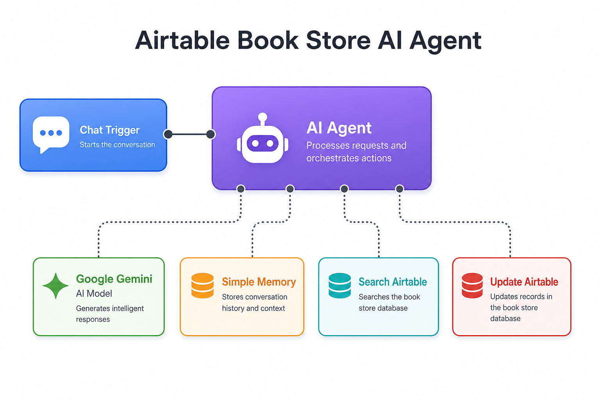

# 📚 Airtable Book Store AI Agent

> Chat with an AI assistant that searches and updates your **Book Store Inventory** in Airtable — powered by **Google Gemini**, with conversation memory and Airtable tools.



---

## ✨ Features

| Feature | Description |
|---------|-------------|
| 💬 **Chat interface** | Ask questions in natural language via n8n chat |
| 🤖 **AI Agent** | Understands intent and picks the right Airtable action |
| 🔍 **Search books** | Find records by title, author, genre, stock, and more |
| ✏️ **Update stock** | Change `Stock Quantity` on any book record |
| 🧠 **Memory** | Remembers context within the conversation |
| ⚡ **Google Gemini** | Fast, capable language model for responses |

---

## 🔄 How it works

```
Chat Message → AI Agent ← Google Gemini (LLM)
                    ↑
                    ├── Simple Memory (conversation history)
                    ├── Search records in Airtable
                    └── Update record in Airtable
```

1. You send a chat message (e.g. *"How many copies of Dune are in stock?"*)
2. The **AI Agent** decides whether to search or update Airtable
3. **Google Gemini** generates a natural language reply
4. **Simple Memory** keeps the conversation context for follow-up questions

---

## 📦 Airtable setup

This workflow connects to:

| Setting | Value |
|---------|-------|
| **Base** | Book Store Inventory |
| **Table** | Books |

### Books table fields

| Field | Used by workflow |
|-------|------------------|
| Title | Search |
| Author | Search |
| ISBN | Search |
| Genre | Search |
| Publisher | Search |
| Stock Quantity | Search + **Update** |
| Price | Search |
| Cost | Search |
| Low Stock Flag | Search |
| Supplier | Search |

> **Note:** The update tool only modifies **Stock Quantity**. All other fields are read-only during updates.

---

## 💬 Example prompts

```
"Show me all books with low stock"
"How many copies of The Great Gatsby do we have?"
"Update stock for record rec123abc to 50"
"List all fiction books"
"What books are published by Penguin?"
```

---

## 🚀 Quick start

### 1. Import workflow

1. Open n8n → **Workflows** → **Import from File**
2. Select `workflow.json`
3. Activate when ready

### 2. Connect credentials

| Node | Credential | How to get it |
|------|------------|---------------|
| **Google Gemini Chat Model** | Google Gemini (PaLM) API | [Google AI Studio](https://aistudio.google.com/) → API key |
| **Search / Update Airtable** | Airtable Personal Access Token | [Airtable tokens](https://airtable.com/create/tokens) with `data.records:read` + `data.records:write` |
| **Groq Chat Model** *(optional)* | Groq API | [console.groq.com](https://console.groq.com/) — not connected by default |

### 3. Select your Airtable base & table

In both Airtable tool nodes:

1. Open **Search records in Airtable**
2. Select your **Base** and **Books** table (or your own)
3. Repeat for **Update record in Airtable**

### 4. Open chat & test

1. Activate the workflow
2. Click **Open Chat** on the **When chat message received** node
3. Try: *"Show me all books in stock"*

---

## 🛠️ Nodes

| Node | Type | Role |
|------|------|------|
| When chat message received | Chat Trigger | Starts the workflow on each message |
| AI Agent | LangChain Agent | Orchestrates tools and LLM |
| Google Gemini Chat Model | LLM | Powers the agent (active model) |
| Groq Chat Model | LLM | Alternative model (not connected) |
| Simple Memory | Memory | Window buffer for chat history |
| Search records in Airtable | Airtable Tool | Search book records |
| Update record in Airtable | Airtable Tool | Update stock quantity |

---

## ⚙️ Configuration

### Switch LLM model

The workflow uses **Google Gemini** by default. To switch to **Groq**:

1. Disconnect **Google Gemini Chat Model** from **AI Agent**
2. Connect **Groq Chat Model** → **AI Agent** (Language Model port)
3. Add your Groq API credential

### Customize update fields

In **Update record in Airtable**, edit the column mapping to allow updating additional fields beyond `Stock Quantity`.

---

## 📁 Files

| File | Description |
|------|-------------|
| `workflow.json` | n8n workflow — import this file |
| `workflow-diagram.png` | Visual architecture diagram |
| `README.md` | This documentation |

---

## 📋 Requirements

- [n8n](https://n8n.io/) (self-hosted or cloud)
- Google Gemini API key
- Airtable Personal Access Token
- Airtable base with a Books (or similar) inventory table

---

## 🔗 Related workflows

| Workflow | Description |
|----------|-------------|
| [Website Status Monitor](../website-status-monitor/) | Monitor a website every 5 min and send Gmail alerts |

---

<p align="center">
  Built with ❤️ using <a href="https://n8n.io">n8n</a> · <a href="https://airtable.com">Airtable</a> · <a href="https://ai.google.dev">Google Gemini</a>
</p>
