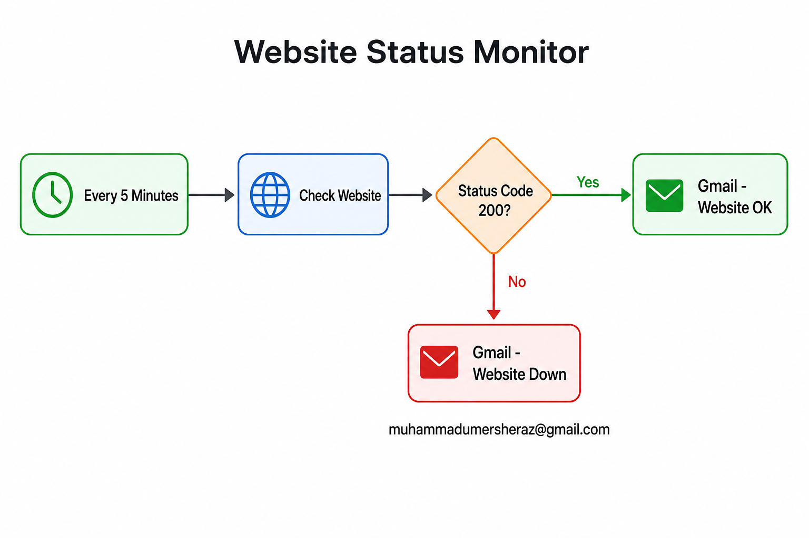

# Website Status Monitor (Every 5 Min)

n8n workflow that checks a website every **5 minutes** and sends a Gmail alert based on the HTTP status code.

## Flow



```
Every 5 Minutes → Set Website URL → Check Website → Normalize Status → Status Code 200?
                                                                          ├─ Yes → Gmail: Website is ok
                                                                          └─ No  → Gmail: Website is down
```

## What it does

| Step | Node | Description |
|------|------|-------------|
| 1 | **Every 5 Minutes** | Schedule trigger — runs every 5 minutes |
| 2 | **Set Website URL** | Sets the website URL once (change only here) |
| 3 | **Check Website** | Sends HTTP GET to `{{ $json.websiteUrl }}` |
| 4 | **Normalize Status** | Builds dynamic `websiteUrl`, `websiteName`, `statusCode`, `isUp` |
| 5 | **Status Code 200?** | Routes to OK or DOWN branch based on `isUp` |
| 6 | **Gmail - Website OK** | Sends email: *"Website is ok"* |
| 7 | **Gmail - Website Down** | Sends email: *"Website is down"* |

**Recipient:** `muhammadumersheraz@gmail.com`

## Files

| File | Description |
|------|-------------|
| `workflow.json` | n8n workflow — import this into n8n |
| `workflow-diagram.png` | Visual diagram of the workflow |
| `README.md` | This documentation |

## Import into n8n

1. Open n8n → **Workflows** → **Import from File**
2. Select `workflow.json`
3. Configure the settings below
4. Toggle workflow **Active**

## Configuration

### 1. Website URL (change in ONE place only)

Open the **Set Website URL** node and update:

```
https://dubaibiglottery.com/
```

All other nodes use this value dynamically — no need to edit Check Website, Normalize Status, or Gmail nodes.

### 2. Gmail credentials

1. Open either **Gmail** node
2. Click **Credential** → **Create new** → **Gmail OAuth2**
3. Click **Sign in with Google** and authorize your account
4. Use the same credential on both Gmail nodes

### 3. Activate

Toggle the workflow to **Active** in the top-right corner.

## Email messages

**When status is 200:**
```
Website: https://dubaibiglottery.com/
Status Code: 200

Website is ok
```

**When status is not 200 or site is unreachable:**
```
Website: https://dubaibiglottery.com/
Status Code: No response / connection failed

Website is down
```

## Requirements

- [n8n](https://n8n.io/) instance (self-hosted or cloud)
- Google account with Gmail OAuth connected in n8n

## Troubleshooting

### "Node was not executed" on Gmail - Website Down

This is **normal** when the website returns status `200`. Only **one** Gmail node runs per execution:

| Website response | Node that runs |
|------------------|----------------|
| Status `200` | Gmail - Website OK |
| Any other status or no response | Gmail - Website Down |

To test the DOWN branch, temporarily change the URL in **Set Website URL** to:

```
https://httpstat.us/503
```

Then run the workflow once. You should receive the DOWN email.

### "Node was not executed" when clicking a single node

Do not click **Execute step** on only the Gmail node. Always run from **Every 5 Minutes** or use **Execute workflow**.

## Notes

- Emails are sent **every 5 minutes** regardless of status (OK or DOWN).
- To alert only when the site goes down, add a filter or memory node before the Gmail nodes.
- Default website URL is `https://dubaibiglottery.com/` — change it only in **Set Website URL**.
